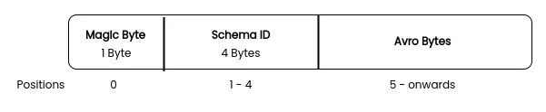

### Working with Kafka

<https://spark.apache.org/docs/latest/structured-streaming-kafka-integration.html>

-   for low latency use cases

#### Serializing and Deserializing values

-   string: `cast()`
-   csv: `from_csv()`
-   json:
    -   serialize: `to_json(struct(<COL_NAMES))`
    -   deserialize: `from_json(<STRING_VALUE>, <SPARK_DATAFRAME_SCHEMA>)`
-   [avro](https://spark.apache.org/docs/latest/sql-data-sources-avro.html):
    -   will require to the `spark-avro` package to the dependency list
    -   serialize: `to_avro(struct(<DESIRED_FIELDS))`
    -   deserializw:`from_avro(<BINARY/BYTES>, <AVRO_SCHEMA_STRING)`

> ##### Confluent Avro Format
>
> -   For producers and consumers work together, Confluent appended the Schema id before actual standard Avro binary format.
>-   This allows consumers to fetch the Schema id, request the schema from Schema Registry and deserialize the bytes.
>-   The Confluent Avro format looks like this:
    
>-   Thus, it will need some preprocessing before we can use `from_avro` to deserialize the event message. See [article](https://medium.com/@mrugankray/real-time-avro-data-analysis-with-spark-streaming-and-confluent-kafka-in-python-426f5e05392d).
>
>    ```py
>    def rearrange_bytes(df:DataFrame):
>        #  Create magic byte column from 1st byte. The first byte is magic byte
>        df = df.withColumn("magicByte", F.expr("substring(value, 1, 1)"))
>        #  Create schema id from value using next 4 byte
>        df = df.withColumn("valueSchemaId", F.expr("substring(value, 2, 4)"))
>        # remove first 5 bytes from value
>        df = df.withColumn("fixedValue", F.expr("substring(value, 6, length(value)-5)"))
>        # creating a new df with magicBytes, valueSchemaId & fixedValue
>        df = df.select("magicByte", "valueSchemaId", "fixedValue")
>        return df
>    ```
>

##### Working with Schema Registry

<https://blogit.michelin.io/kafka-to-delta-lake-using-apache-spark-streaming-avro/>

```py
# Retrieve GPS Schema from Schema Registry

from confluent_kafka.schema_registry import SchemaRegistryClient

schema_registry_conf = {
    'url': schemaRegistryUrl,
    'basic.auth.user.info': '{}:{}'.format(schemaRegistryApiKey, schemaRegistrySecret)}

schema_registry_client = SchemaRegistryClient(schema_registry_conf)
gps_schema_response = schema_registry_client.get_latest_version(topicName + "-value").schema
gps_schema = gps_schema_response.schema_str

...

# deserialize the value colymn

from pyspark.sql.avro.functions import from_avro

from_avro_options= {"mode":"PERMISSIVE"}

structuredGpsDf = (
  gpsDF
  .select(from_avro(fn.expr("substring(value, 6, length(value)-5)"), gps_schema, from_avro_options).alias("value"))
  .selectExpr("value.timestamp", "value.deviceId", "value.latitude", "value.longitude", "value.altitude", "value.speed") \
)

display(structuredGpsDf)

```

#### Kafka Sinks

-   Sending to kafka will require a specific structure for dataframe.
    -   The dataframe can only have two cols: `key`, `value`.
    -   `value` column will have a json string for the fields you are sending over

#### Multiple Streams

-   Each query/stream must have a unique checkpoint location!!
-   `spark.streams.awaitAnyTermination()`

```py
from pyspark.sql import SparkSession
from pyspark.sql.functions import from_json, col, expr
from pyspark.sql.types import StructType, StructField, StringType, LongType, DoubleType, IntegerType, ArrayType

from lib.logger import Log4j

if __name__ == "__main__":
    spark = SparkSession \
        .builder \
        .appName("Multi Query Demo") \
        .master("local[3]") \
        .config("spark.streaming.stopGracefullyOnShutdown", "true") \
        .getOrCreate()

    logger = Log4j(spark)

    # define schema
    schema = StructType([
        StructField("InvoiceNumber", StringType()),
        StructField("CreatedTime", LongType()),
        StructField("StoreID", StringType()),
        StructField("PosID", StringType()),
        StructField("CashierID", StringType()),
        StructField("CustomerType", StringType()),
        StructField("CustomerCardNo", StringType()),
        StructField("TotalAmount", DoubleType()),
        StructField("NumberOfItems", IntegerType()),
        StructField("PaymentMethod", StringType()),
        StructField("CGST", DoubleType()),
        StructField("SGST", DoubleType()),
        StructField("CESS", DoubleType()),
        StructField("DeliveryType", StringType()),
        StructField("DeliveryAddress", StructType([
            StructField("AddressLine", StringType()),
            StructField("City", StringType()),
            StructField("State", StringType()),
            StructField("PinCode", StringType()),
            StructField("ContactNumber", StringType())
        ])),
        StructField("InvoiceLineItems", ArrayType(StructType([
            StructField("ItemCode", StringType()),
            StructField("ItemDescription", StringType()),
            StructField("ItemPrice", DoubleType()),
            StructField("ItemQty", IntegerType()),
            StructField("TotalValue", DoubleType())
        ]))),
    ])

    kafka_df = spark.readStream \
        .format("kafka") \
        .option("kafka.bootstrap.servers", "localhost:9092") \
        .option("subscribe", "invoices") \
        .option("startingOffsets", "earliest") \
        .load()

    # bytes -> string -> json
    value_df = kafka_df.select(from_json(col("value").cast("string"), schema).alias("value"))

# ------------------------- STREAM 1 -------------------------------------------------

    notification_df = value_df.select("value.InvoiceNumber", "value.CustomerCardNo", "value.TotalAmount") \
        .withColumn("EarnedLoyaltyPoints", expr("TotalAmount * 0.2"))

    # Sending to kafka requires a specific df structure of two columns: key, value
    kafka_target_df = notification_df.selectExpr("InvoiceNumber as key", "to_json(struct(*)) as value")

    notification_writer_query = kafka_target_df \
        .writeStream \
        .queryName("Notification Writer") \
        .format("kafka") \
        .option("kafka.bootstrap.servers", "localhost:9092") \
        .option("topic", "notifications") \
        .outputMode("append") \
        .option("checkpointLocation", "chk-point-dir/notify") \
        .start()

# ------------------------- STREAM 2 -------------------------------------------------

    explode_df = value_df.selectExpr(
        “”"value.InvoiceNumber"
        , "value.CreatedTime"
        , "value.StoreID"
        , "value.PosID"
        , "value.CustomerType"
        , "value.PaymentMethod"
        , "value.DeliveryType"
        , "value.DeliveryAddress.City"
        , "value.DeliveryAddress.State"
        , "value.DeliveryAddress.PinCode"
        , "explode(value.InvoiceLineItems) as LineItem"
      )

    flattened_df = explode_df \
        .withColumn("ItemCode", expr("LineItem.ItemCode")) \
        .withColumn("ItemDescription", expr("LineItem.ItemDescription")) \
        .withColumn("ItemPrice", expr("LineItem.ItemPrice")) \
        .withColumn("ItemQty", expr("LineItem.ItemQty")) \
        .withColumn("TotalValue", expr("LineItem.TotalValue")) \
        .drop("LineItem")

    invoice_writer_query = flattened_df.writeStream \
        .format("json") \
        .queryName("Flattened Invoice Writer") \
        .outputMode("append") \
        .option("path", "output") \
        .option("checkpointLocation", "chk-point-dir/flatten") \
        .start()

    logger.info("Waiting for Queries")
    # Terminate if any streams stops
    spark.streams.awaitAnyTermination()
```

### [Kafka Best Practices for Production](https://blog.clairvoyantsoft.com/productionalizing-spark-streaming-applications-4d1c8711c7b0)

-   Setup Multiple Partitions in your Kafka Topics
    -   When data is pushed into a Kafka topic, the data is automatically distributed across the partitions by the Key you define in the Kafka Message.
    -   Each message is added to the Kafka topic with an offset associated with it or an ID that indicates its position in the partition. If you were to specify null as the Key, the message will be automatically distributed evenly across the partitions.
-   The above diagram shows how the Big Data Spark Streaming Application can work when it’s processing messages from a Kafka topic with multiple partitions.
-   Each “Consumer” can be thought of as one of the Spark Executors. Each Spark Executor can independently load data from a specific Kafka topic, rather than a single source.
-   In addition, each partition can also exist on a different Kafka Broker instance (separate node), which will help to decrease the load on any one node.
