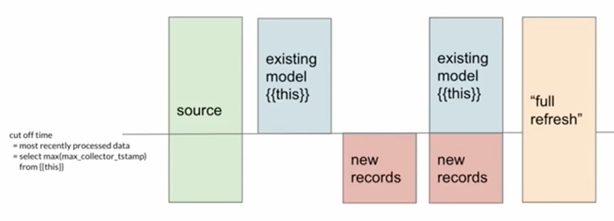

dbt run --profiles-dir /usr/local/airflow/include/dbt/

### Models

> Think of data models as **a set of transformations** that takes data from its raw form and turns it into something usable by other members of data teams.

-   Complex data pipelines broken down into smaller, manageable units called `models`
-   A model is a `SELECT` statement that can be materialised as a table or as a view.
    -   All the business logic will be in these model `SELECT` statements.
    -   Supports use of Jinja macros, allowing code snippets to be reused across different models.
-   Model are defined in `.sql` files in the DBT project under the `models` folder.
    -   The filename is the name of the model by default.
-   You can also add metadata on models (in YAML).
-   By building the final data product one piece at a time,
    -   Each model is reusable for other downstream models.
    -   Easier to maintain, since easier to identify and fix issues in specific parts of the pipeline

#### Creating Models

```sql
--models/my_model.sql

-- Set model related config within the config block
{{ config(
    materialized='incremental'  -- defines whether model is table, view or incremental
) }}

SELECT MARKS.*,
    STUDENT.NAME AS STUDENT_NAME,
    SUBJECT.NAME AS SUBJECT_NAME
FROM {{ ref('MARKS_STAGE') }} MARKS
LEFT JOIN  {{ ref('STUDENT_STAGE') }} STUDENT
ON STUDENT.ID = MARKS.STU_ID
LEFT JOIN  {{ ref('SUBJECT_STAGE') }} SUBJECT
ON SUBJECT.ID = MARKS.SUB_ID
```

-   `dbt run`: Run all models
    -   The appropriate DDL/DML to build these models is generated
    -   If that model already exists in the data warehouse, the database object is dropped before the new database object is created.
-   `dbt run --select <model_name>`: Run a specific model +?
-   To run a model in full refresh mode, add `--full-refresh`.
-   Note: For BigQuery, may need to run `dbt run --full-refresh`.

#### Naming Conventions

-   sources (`src`):        raw data that has already been loaded
-   staging (`stg`):        data that's clean and standardized
-   intermediate (`int`):   models between staging and final models
-   dimensions (`dim`):     models that stored info around an entity
-   facts (`fct`):          models that records events that have occurred

#### Materialization

-   Materialization define how dbt builds the models
-   Defining the materialization can be done via (by order of precedence)
    -   config block
    -   `dbt_project.yml` at the folder level
        -   Note that this method has lower precedence.
            ```yaml
            models:
                <project_name>:
                    marts:
                        core:
                            +materialized: table
                    staging:
                        +meterialized: view
            ```
-   Currently, the materialization available are: views, table, ephermal, incremental, snapshot 
<br/>
    >  ###### How do we want to materialize the model?
    > - Start with `view`
    > - When it takes too long to query, switch to `table`
    > - When it takes too long to build, switch to `incremental`

    -   Views 
        -   Built as views in the database 
        -   Query is stored on disk 
        -   Faster to build but Slower to query (view need to be built first) 
        -   Config block:
            ```sql
            {{ config(
                materialized='view'
            )}}
            ``` 
    - Tables 
        - Built as tables in the database 
        - Data is stored on disk i.e. persisted 
        - Slower to build but faster to query 
        - Config block:
            ```sql
            -- config block
            {{ config(
                materialized='table'
            )}}
            ```

    - Ephemeral Models (i.e. Temp tables)
        - Does not exist in the database
        - Imported as CTE into downstream models
        - Increases build time of downstream models
        - Cannot query directly
            ``` sql
            {{ config(
                materialized='ephemeral'
            )}}
            ```
    - [Incremental Models](https://docs.getdbt.com/docs/building-a-dbt-project/building-models/materializations#incremental) i.e. `MERGE INTO`

        - Built as table in the database
        - On the first run, builds entire table
        - On subsequent runs, only appends new records
          
        - Faster to build because you are only adding new records
        - Does not capture 100% of the data all the time
        - Implementation:
            1. Indicate intent to build model as incremental 
                ``` sql
                {{ config(
                    materialized='incremental',  -- indicate incremental model
                    incremental_strategy='merge', --Other options append, delete+insert
                    unique_key = 'page_view_id'  -- MERGE INTO Key to avoid duplicates
                )}}
                ```
            2. Identify new rows on subsequent runs
                ``` sql
                with events as (
                    SELECT *
                    FROM {{ source ('snowplow', 'events') }}
                    -- conditional WHERE clause if incremental
                    
                    where collector_tstamp >= (SELECT MAX(max_collector_tstamp) from {{this}})
                    
                ),
                ...
                ```
                - Special Jinja Variables
                    - `{{this}}`: Represents the currently existing database object mapped to this model
                    - `is_incremental()`: 
                      - Check for 4 conditions:
                        - Does this model already exists as an object in the database? (Y)
                        - Is that database object a table? (Y)
                        - Is this model configured with `materialized=incremental`?(Y)
                        - Was `--full-refresh` flag passed to this dbt run? (N)
        - Suitable for immutable event streams (i.e. append-only, tall skinny tables, no updates)
            - if updates, a reliable `updated_at` field 
        - Possible issues
            - Late arriving information -> Have a overlapping buffer window for the cutoff
            - Deciding on a good cutoff -> analyze the data (i.e. 99% falls within range)
            - Think of the tradeoffs. Is the accuracy worth the cost and performance?

    - [Snapshots](https://docs.getdbt.com/docs/building-a-dbt-project/snapshots) (i.e. SCD 2)
        - Built as a table in the database, usually in a dedicated schema.
        - Allows you to capture historical data
        - Implementation
          1. Config bLOCK
            ``` sql
            

            

            {{
                config(
                target_database='analytics',
                target_schema=new_schema,
                unique_key='order_id',

                strategy='timestamp',
                updated_at='updated_at'
                )
            }}

            select * from analytics.{{target.schema}}.mock_orders

            
            ```
          2. `dbt snapshot`
             - On the first run, builds entire table and adds four columns: 
               - `dbt_scd_id`, 
               - `dbt_updated_at`, 
               - `dbt_valid_from` 
               - `dbt_valid_to`
             - In future runs, dbt will scan the underlying data and append new records based on the configuration that is made.