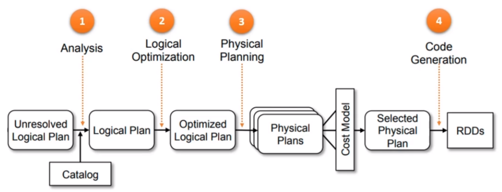

## Spark APIs

### Resilent Distributed Datasets (RDDs)

#### Resilient

- i.e. fault-tolerant.
- RDDs are fault-tolerant because they also store info about how they are created. This allows a RDD partition to be recreated and reprocessed anywhere in the cluster.
- If an executor fails or crashes and loses the RDD partition, the driver will notice the failure and assign the same RDD partition to another executor core.
- The new executor core will reload the RDD partition and start the processing

#### Distributed

- Internally broken down into partitions to form a distributed collection.
- Partitioned and spread across the executor cores to allow for parallel processing

#### Dataset

- An RDD is a data structure to hold your data records.
- They are similar to DataFrames because DataFrames are also built on top of the RDDs.
- Unlike DataFrames, RDD records are just language-native objects, and they do not have a row/column structure and a schema. In simple words, RDD is just like a Scala, Java, or a Python collection.

```py
# creating a RDD
data = [1, 2, 3, 4, 5]
rdd = sc.paralleize(data)

```

### RDD Operations

#### Transformations

- creates another RDD from an existing RDD
- RDD transformations are lazy. In antoher words, executions are not done immediately. However, their execution plans are recorded
- e.g. map, filter, flatmap

```py
# examples of RDD transformations
squared_rdd = rdd.map(lambda x: x**2)
even_rdd = rdd.filter(lambda x: x % 2 == 0)
```

#### Actions

- triggers the execution of transformations and return results to the driver program
- eagerly evaluated and initate computation on the rdd
- e.g. `collect`, `count`, `reduce`

```py
collected_data = squared_rdd.collect()
num_elements = squared_rdd.count()
```

### An Example

``` py
import sys
from pyspark import SparkConf
from collections import namedtuple
from pyspark.sql import SparkSession
from lib.logger import Log4j

# use namedtuple to create schema
SurveyRecord = namedtuple("SurveyRecord", ["Age", "Gender", "Country", "State"])

if __name__ == "__main__":
    conf = SparkConf() \
        .setMaster("local[3]") \
        .setAppName("HelloRDD")
        
    # SparkContext needed to use RDD API
    # sc = SparkContext(conf=conf)
    spark = SparkSession.builder.config(conf=conf).getOrCreate()
    sc = spark.sparkContext
    logger = Log4j(spark)

    if len(sys.argv) != 2:
        logger.error("Usage: HelloSpark <filename>")
        sys.exit(-1)

    # read csv file as txt file and split into 2 partitions
    linesRDD = sc.textFile(sys.argv[1])
    partitionedRDD = linesRDD.repartition(2)

    # map(): calls a lambda function in a loop for each line.
    # remove the double quotes since processing csv file as plain text. Rwturns list of strings, creating the row-column structure
    colsRDD = partitionedRDD.map(lambda line: line.replace('"', '').split(","))
    
    # convert each row into SurveyRecord Object
    # select columns
    selectRDD = colsRDD.map(lambda cols: SurveyRecord(int(cols[1]), cols[2], cols[3], cols[4]))

    # filter rows for age < 40>
    filteredRDD = selectRDD.filter(lambda r: r.Age < 40)
    
    # Group row count by country
    # Assign each row a value of 1
    kvRDD = filteredRDD.map(lambda r: (r.Country, 1))
    
    # Sum value by country key
    countRDD = kvRDD.reduceByKey(lambda v1, v2: v1 + v2)

    colsList = countRDD.collect()
    for x in colsList:
        logger.info(x)
```

### DataFrame & Dataset APIs

#### SQL API

- Note: you can execute SQL expression only on a table or view. You can register your DataFrame as a View using `.createOrReplaceTempView(<View_Name>)`
- The `.sql()` method executes SQL expression and returns a DataFrame.
  
``` py
import sys
from pyspark.sql import SparkSession
from lib.logger import Log4j

if __name__ == "__main__":
    spark = SparkSession \
        .builder \
        .master("local[3]") \
        .appName("HelloSparkSQL") \
        .getOrCreate()

    logger = Log4j(spark)

    if len(sys.argv) != 2:
        logger.error("Usage: HelloSpark <filename>")
        sys.exit(-1)

    surveyDF = spark.read \
        .option("header", "true") \
        .option("inferSchema", "true") \
        .csv(sys.argv[1])

    surveyDF.createOrReplaceTempView("survey_tbl")
    countDF = spark.sql("select Country, count(1) as count from survey_tbl where Age<40 group by Country")

    countDF.show()
```

#### Dataset API

- provides a typesafe object-oriented programming interface with the performance optimizations of dataframe AP
- allows us to work with strongly-typed data

```py
from pyspark.sql.types import StructType, StructField, StringType, IntegerType

# defining a schema to specified the column names and data type
schema = StructType([
    StructField('Name', StringType(), True),
    StructField('Age', IntegerType(), True),
    StructField('Salary', IntegerType(), True)
])

# data values
data = [
    ('Alice', 28, 45000),
    ('Bob', 36, 60000),
    ('Cathy', 23, 35000)
]

df = spark.createDataFrame(data, schema)
df = df.alias('employees')
df.show()
```

<br>

#### DataFrame API

- provides a higher-level, more structured way to work with data
- makes working in pyspark more intuitive and efficient

```py
data_file = 'path/to/data.csv'
df = spark.read.csv(data_file, header = True, inferSchema = True)
```

### Working with semi-structured data

```py
# for reading json data
json_data_file = 'path/to/data.json'
df = spark.read.json(json_data_file)

# for reading XML data
xml_data_file = 'path/to.data.xml'
df = spark.read.format('xml').option('rowTag', 'employee').load(xml_data_file)

```

### Spark SQL Engine and the Catalyst Optimizer

- The Spark SQL engine is a powerful compiler that optimizes your code and also generates efficient Java Bytecode.
- The overall effort of the Spark SQL engine can be broken down into four phases.
  - Analysis
  - Logical optimization
  - Physical planning
  - Whole Stage CodeGen



#### Analysis

- At the Analysis stage the code is parsed your for errors and incorrect names and a fully resolved logical plan is created.
  - the Spark SQL engine will read your code and generate an Abstract Syntax Tree for your SQL or the DataFrame queries.
  - the Spark SQL engine will look into the Catalog to resolve the column names and its data type.
  - The Spark SQL engine might also apply an implicit type casting to the columns to perform and validate the other operations.
  - Your code is analyzed, and the column names, table, or view names, SQL functions are resolved.
- You might get a runtime error shown as an Analysis exception if the column names do not resolve or have some incorrect typecasting, or you used an invalid function name, etc
- If the code passed this phase, it implies that the code is valid

#### Logical optimization

- the SQL engine will apply rule-based optimization to optimize the logical plan
- The logical optimization includes standard SQL optimization techniques such as
  - Constant folding
  - Predicate Pushdown
  - Partition Pruning
  - Null Propagation
  - Boolean expression simplification
- Once pass this phase, the logical plan is optimized

#### Physical planning

- The SQL Engine takes the logical plan and and construct a set of multiple execution plans.
- Then the catalyst optimizer will use cost-based optimization to select the plan with the least cost
  - for e.g. with joins, different join algorithms are used to create more than one physical plan i.e they might create one plan using broadcast join and another using Sort merge, and one more using shuffle hash join.
  - Then they calculate/apply a cost to each plan and choose the best one.
- the SQL engine picks the most effective logical plan and generates a physical plan.
- The physical plan is a set of RDD operations, which determines how the plan is going to execute on the Spark cluster

#### whole-stage-code-generation

- This phase involves generating efficient Java bytecode to run on each machine.
- This phase was introduced in Spark 2.0 as part of the Project Tungsten, initiated to apply ideas from modern compilers and MPP databases and make Spark run more efficiently.

Spark code is nothing but a sequence of Spark Jobs.
And each Spark Job represents a logical query plan.
This first logical plan is a user-created logical query plan.

