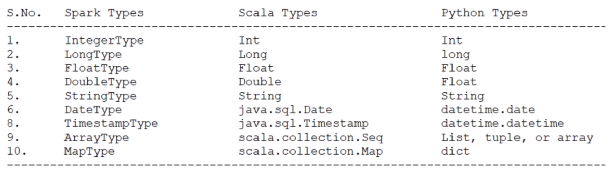

## Data Storage

### Data Sources

- Data Sources can be further categorized into two groups.
  - External Data Sources
  - Internal Data Sources

#### External Data Stores

- Examples include:
  - JDBC Data Sources for e.g. Oracle, SQL Server, MySQL, PostgreSQL etc.
  - NoSQL Data Systems such as Cassandra, MongoDB
  - Cloud Data Warehouses such as Snowflake, Redshift
  - Stream Integrators such as Kafka
- Methods to read data from external sources
  - Ingest and store your data in your Data Lake's distributed storage.
    - The most commonly used approach is to use a suitable data integration tool.
      - Ability to use the best tool meant for the data store
      - To decouple the ingestion from the processing to improve manageability.
    - Better for batch processing cases
  - Use Spark Data Source API to directly connect with these external systems.
    - Better for streaming processing

#### Internal Data Sources

- Distributed storage such as HDFS or cloud-based storage. Either way, your data is stored in these systems as a data file. The mechanics of reading data from HDFS or from cloud storage is the same.
- Here are some commonly used file formats.
  - CSV
  - JSON
  - Parquet (Recommended, Default)
  - AVRO
  - Plain Text
There is also Spark SQL Tables and Delta Lake which are backed by data files but they also include some additional metadata that is stored outside the data file. So technically not file sources.

### Data Sink

- The data sinks are the final destination of the processed data. This is where the data is save after the processing is complete
- While it is possible to write data to external stores, it is not recommended.

### DataFrameReader API

- Spark allows you to read data using the DataFrameReader API which can be accessed through the SparkSession via the read method.
- The read() method read the data and outputs a Spark DataFrame.
- Customization can be done through the DataFrameReader's option() method which takes key-value pairs,
- Recommended to use a function to read the data so that it is easier to test
- Here is the general structure of the DataFrameReader API.

  ``` py
  DataFrameReader
    .format(...)
    .option("key", "value")
    .schema(...)
    .load()
  ```

- Once you have the DataFrameReader, you can specify four main things before calling the load() method to read the data and create a DataFrame.
  - Format of your data source
  - Specify the options.
  - Read Mode
  - Schema

#### Data Source Format

- Spark DataFrameReader reader supports several built-in formats such as CSV, JSON, Parquet, ORC, and JDBC.
- The DataFrameReader API is extended by the community to support hundreds of external data sources such as Cassandra, MongoDB, XML, HBase, Redshift, and many more.

#### Read Options

- Every data source has a specific set of options to determine how the DataFrameReader is going to read the data.

#### Read Mode

- Read modes specify what will happen when Spark comes across a malformed record.
- Spark allows three read modes.
  - **Permissive** (default): sets all the fields to null when it encounters a corrupted record and places the corrupted records in a string column called _corrupt_record.
  - **dropMalformed**: ignoring the malformed records and only loading the well-formed records.
  - **failFast**: raises an exception and terminates immediately upon encountering a malformed record.

#### Schema

- DataFrame schema is all about setting the column name and appropriate data types.
- For data sources such as Parquet and AVRO, there is a well-defined schema inside the data source itself. Hence, manually defining schema is option
- Otherwise, while DataFrameReader might allows you to infer the schema, it is on a best guess bases and explicitly specifying a schema is recommended
- DataFrameReader also comes with some shortcuts and variations for `.csv()` method. However, it is not recommended and we follow the standard style as it will help with code maintainability.

##### Defining Schema

###### Spark Data Types

- Here are the ten most commonly used types. Full list available [here](https://spark.apache.org/docs/latest/sql-ref-datatypes.html)


**Why Spark maintains its own types?**  
Spark is like a compiler. It complies with the high-level API code into low-level RDD operations.
During this compilation process, it generated different execution plans and also performed a bunch of optimizations.
This all is not at all possible for the Spark engine without maintaining its own type of information.

###### Defining Schema

- Spark allows you to define Schema in two ways
  - Programmatically
  - Using DDL String

- the Programmatic method
  - `StructType([StructField(<COL_NAME>, <SPARK_DATA_TYPE>), ...])`.
  - Note: it must be one of the Spark Data Types.
  - If the types in the data do not match the Schema at runtime, Spark will throw an error. However, you must set the mode for getting the error

    ``` py
    from pyspark.sql.types import StructType, StructField, DateType, StringType, IntegerType

    # StructType represents a DataFrame row structure
    # StructField is a column definition.
    flightSchemaStruct = StructType([
            StructField("FL_DATE", DateType()),
            StructField("OP_CARRIER", StringType()),
            StructField("OP_CARRIER_FL_NUM", IntegerType()),
            StructField("ORIGIN", StringType()),
            StructField("ORIGIN_CITY_NAME", StringType()),
            StructField("DEST", StringType()),
            StructField("DEST_CITY_NAME", StringType()),
            StructField("CRS_DEP_TIME", IntegerType()),
            StructField("DEP_TIME", IntegerType()),
            StructField("WHEELS_ON", IntegerType()),
            StructField("TAXI_IN", IntegerType()),
            StructField("CRS_ARR_TIME", IntegerType()),
            StructField("ARR_TIME", IntegerType()),
            StructField("CANCELLED", IntegerType()),
            StructField("DISTANCE", IntegerType())
        ])

        # To use schema, load schema into read()
        flightTimeCsvDF = spark.read \
            .format("csv") \
            .option("header", "true") \
            .schema(flightSchemaStruct) \
            .option("mode", "FAILFAST") \
            .option("dateFormat", "M/d/y") \
            .load("data/flight*.csv")
    ```

<br>

- The DDL Method

  - All you need is the column name and data type separated by a comma.
  And you can use this Schema in the same way as a Programmatically defined schema.

    ``` py
    flightSchemaDDL = """FL_DATE DATE, OP_CARRIER STRING, OP_CARRIER_FL_NUM INT, ORIGIN STRING, 
            ORIGIN_CITY_NAME STRING, DEST STRING, DEST_CITY_NAME STRING, CRS_DEP_TIME INT, DEP_TIME INT, 
            WHEELS_ON INT, TAXI_IN INT, CRS_ARR_TIME INT, ARR_TIME INT, CANCELLED INT, DISTANCE INT"""

    flightTimeJsonDF = spark.read \
            .format("json") \
            .schema(flightSchemaDDL) \
            .option("dateFormat", "M/d/y") \
            .load("data/flight*.json")          
    ```

``` py
from pyspark.sql import SparkSession
from pyspark.sql.types import StructType, StructField, DateType, StringType, IntegerType

from lib.logger import Log4j

if __name__ == "__main__":
    spark = SparkSession \
        .builder \
        .master("local[3]") \
        .appName("SparkSchemaDemo") \
        .getOrCreate()

    logger = Log4j(spark)

    flightSchemaStruct = StructType([
        StructField("FL_DATE", DateType()),
        StructField("OP_CARRIER", StringType()),
        StructField("OP_CARRIER_FL_NUM", IntegerType()),
        StructField("ORIGIN", StringType()),
        StructField("ORIGIN_CITY_NAME", StringType()),
        StructField("DEST", StringType()),
        StructField("DEST_CITY_NAME", StringType()),
        StructField("CRS_DEP_TIME", IntegerType()),
        StructField("DEP_TIME", IntegerType()),
        StructField("WHEELS_ON", IntegerType()),
        StructField("TAXI_IN", IntegerType()),
        StructField("CRS_ARR_TIME", IntegerType()),
        StructField("ARR_TIME", IntegerType()),
        StructField("CANCELLED", IntegerType()),
        StructField("DISTANCE", IntegerType())
    ])

    flightSchemaDDL = """FL_DATE DATE, OP_CARRIER STRING, OP_CARRIER_FL_NUM INT, ORIGIN STRING, 
          ORIGIN_CITY_NAME STRING, DEST STRING, DEST_CITY_NAME STRING, CRS_DEP_TIME INT, DEP_TIME INT, 
          WHEELS_ON INT, TAXI_IN INT, CRS_ARR_TIME INT, ARR_TIME INT, CANCELLED INT, DISTANCE INT"""

    flightTimeCsvDF = spark.read \
        .format("csv") \
        .option("header", "true") \
        .schema(flightSchemaStruct) \
        .option("mode", "FAILFAST") \
        .option("dateFormat", "M/d/y") \
        .load("data/flight*.csv")

    flightTimeCsvDF.show(5)
    logger.info("CSV Schema:" + flightTimeCsvDF.schema.simpleString())

    flightTimeJsonDF = spark.read \
        .format("json") \
        .schema(flightSchemaDDL) \
        .option("dateFormat", "M/d/y") \
        .load("data/flight*.json")  # using wildcard to target specific files

    flightTimeJsonDF.show(5)
    logger.info("JSON Schema:" + flightTimeJsonDF.schema.simpleString())

    flightTimeParquetDF = spark.read \
        .format("parquet") \
        .load("data/flight*.parquet")

    flightTimeParquetDF.show(5)
    logger.info("Parquet Schema:" + flightTimeParquetDF.schema.simpleString())
```

### DataWriter API

- Spark allows you to write data using DataFrameWriter API.
- The DataFrameWriter is a standardized API to work with a variety of internal and external data sources.
- Here is the general structure of the DataFrameWriter API.

  ``` py
  DataFrameReader
    .format(...)
    .option("key", "value")
    .schema(...)
    .load()
  ```

- Once you have the DataFrameWriter, you can specify four main things.
  - Output format
  - Write Options
  - Save Mode
  - Layout of your output data.
- Output a few types of files
  - the data file.
  - CRC file, which holds the data file checksum.
  - the SUCCESS file indicates that the write operation was successful.

#### Output format

- Spark supports a bunch of internal file formats such as CSV, JSON, Parquet, AVRO, ORC, etc. However, Parquet is the default file format. So, DataFrameWriter assumes Parquet when you do not specify the format.
- External file formats i.e. JDBC, Cassandra, MongoDB, Kafka, and Delta Lake.

#### Write Options

- Every data sink have their different write options
- At a minimum, you must specify the target of your DataFrame i.e. directory location.

#### Save mode

- Save modes specifies what will happen when Spark existing finds data at the specified location.
- We have four valid modes
  - append mode will create new files without touching the existing data at the given location
  - overwrite will remove the existing data files and create new files
    - A two-step process: Clean the directory and then write the new files.
  - errorIfExists will throw an error when you already have some data at the specified location
  - ignore will write the data if and only if the target directory is empty and do nothing if some files already exist at the location.

#### Layout of your output data

- This includes:
  - Number of files and file size
  - Organizing your output in partitions and buckets
  - Storing sorted data

>NOTE: Partitioning our data might get us two types of direct benefits
>   - Parallel Processing
>   - Partition Elimination: When data is stored in partitions based partition columns, it allows the Spark SQL engine to speed up optimize read and filter operation by skipping over some files and only reading the files that fit the criteria.

- Repartition of data can be done in three different ways
  - Blind partitioning via DataFrame`.repartition()` method
  - Partition based on column/s via `.partitionBy()` method.
    - The partitionBy() method will repartition your data based on a key column.
    - The key column can be a single column i.e. country code or a composite column key i.e. country code + state code.
    - Helps to improve performance using the partition pruning technique.
  - Bucketing via `.bucketBy()` method.
    - This partitions your data into a fixed number of predefined buckets
    - only available on Spark managed tables.
    - Sometimes, bucketing can improve join operations significantly.
    - Note: The sortBy() method is commonly used with the bucketBy() to create sorted buckets. Sorting can further help with performance for certain operations

> ###### How bucketing works?
>
> Suppose a request to create five buckets.
>
>- So Spark created five files as each file is one bucket.
>- For each record, based on the key column values, a hash value is computed
>- Divide it by five and take the remainder. You are going to get something between 0 to 4.
> - If the remainder is 0, place the record in the first file.
> - If you got 1, put it in the second file and so on.
>- As an end result, each unique key combination is going to produce the same hash value,and hence land in the same file.

#### maxRecordsPerFile

MaxRecordsPerFile is an option that allows you to limit the number of records per file.

- Limits the file size based on the number of records to avoid creating huge and inefficient files.
- You can use this option with or without partitionBy().

``` py
from pyspark.sql import *
from pyspark.sql.functions import spark_partition_id

from lib.logger import Log4j

if __name__ == "__main__":
    ...

    logger.info("Num Partitions before: " + str(flightTimeParquetDF.rdd.getNumPartitions()))
    flightTimeParquetDF.groupBy(spark_partition_id()).count().show()

    partitionedDF = flightTimeParquetDF.repartition(5)
    logger.info("Num Partitions after: " + str(partitionedDF.rdd.getNumPartitions()))
    partitionedDF.groupBy(spark_partition_id()).count().show()

    partitionedDF.write \
        .format("avro") \
        .mode("overwrite") \
        .option("path", "dataSink/avro/") \
        .save()

    flightTimeParquetDF.write \
        .format("json") \
        .mode("overwrite") \
        .option("path", "dataSink/json/") \
        .partitionBy("OP_CARRIER", "ORIGIN") \
        .option("maxRecordsPerFile", 10000) \
        .save()
```

### Spark Tables

#### Global Managed Table

A managed table is a Spark SQL table for which Spark manages both the data and the metadata. A global managed table is available across all clusters. When you drop the table both data and metadata gets dropped.
dataframe.write.saveAsTable("my_table")

#### Global Unmanaged/External Table

Spark manages the metadata, while you control the data location. As soon as you add ‘path’ option in dataframe writer it will be treated as global external/unmanaged table. When you drop table only metadata gets dropped. A global unmanaged/external table is available across all clusters.
dataframe.write.option('path', "<your-storage-path>").saveAsTable("my_table")

#### Local Table (a.k.a) Temporary Table (a.k.a) Temporary View

Spark session scoped. A local table is not accessible from other clusters (or if using databricks notebook not in other notebooks as well) and is not registered in the metastore.
dataframe.createOrReplaceTempView()

#### Global Temporary View

Spark application scoped, global temporary views are tied to a system preserved temporary database global_temp. This view can be shared across different spark sessions (or if using databricks notebooks, then shared across notebooks).
dataframe.createOrReplaceGlobalTempView("my_global_view")
can be accessed as,
spark.read.table("global_temp.my_global_view")

#### Global Permanent View

Persist a dataframe as permanent view. The view definition is recorded in the underlying metastore. You can only create permanent view on global managed table or global unmanaged table. Not allowed to create a permanent view on top of any temporary views or dataframe. Note: Permanent views are only available in SQL API — not available in dataframe API
spark.sql("CREATE VIEW permanent_view AS SELECT * FROM table")
