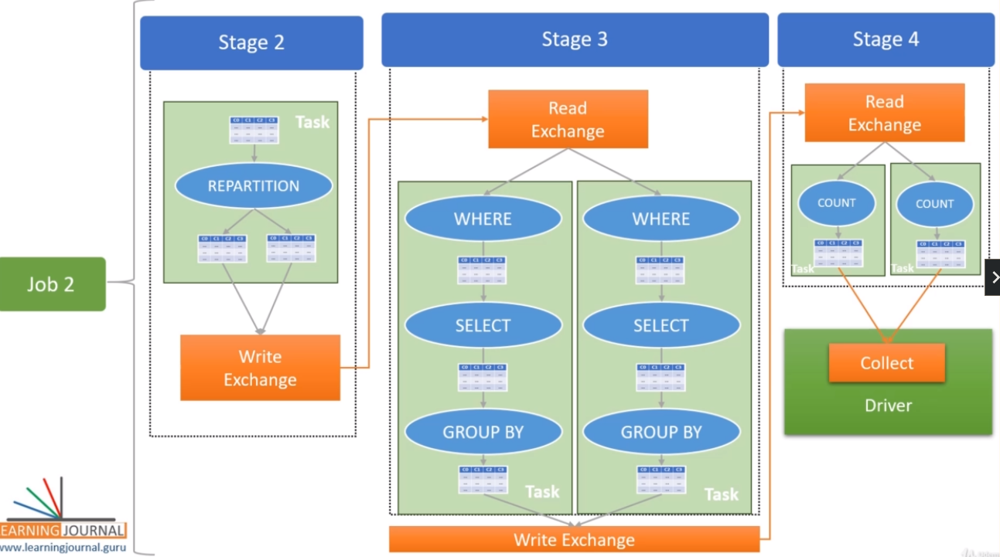

## The Execution Plan

### Reading DataFrames

- In production, data is stored using distributed storage such as HDFS, Amazon S3
- With distributed storage systems, data is split into multiple partitions are stored across the distributed storage nodes.
- Given that the data is already partitioned, for the Spark driver to read and process the data will require reading multiple data parititons
- For this to happen, the driver will reach out to the cluster manager and the storage manager to get the details about the data file partitions.
- With this infomation (i.e. how to read the data file and how many partitions are there), the driver create a logical in-memory data structure at runtime, which we see as a DataFrame.
- Note that nothing is loaded in the memory yet.
- Its simply a logical structure with enough information to actually load it.
- Next the driver starts the executors and assigns each executor core some data partitions and the executors will load their respective partitions in the memory.

### Processing DataFranes

- RECAP: Spark DataFrames are immutable.
- Suppose we have some transactions that we like to apply and have sent to the SparkSession
- Note: SparkSession uses a builder pattern
- Looking at all the transformations, we are creating a DAG of operations.
- In essence, Spark data processing is all about creating a DAG of operations. We apply operation after operation on the dataframe.
- These operations are of two types
  - Transformations
  - Actions

#### Transformations

- Used to transform one DataFrame into another DataFrame without modifying the original DataFrame for e.g., the `where()` method
- Transactions are applied on the input DataFrame to produces an output DataFrame. The initial input DataFrame remains immutable.

- Transformations can be further classified into two types.
  - Narrow Dependency Transformation
    - A transformation that can be performed within a single partition and still produce an overall valid result for e.g. the where() clause
    - For e.g. If you apply a where() clause on the dataframe, Spark executor should be able to perform this filtering on each partition.
    - They do not depend on any other partition and we still get a valid overall result on combining these filtered partitions.
    - This allows the executors to work on their partitions in parallel
    - i.e. select(), filter(), withColumn(), drop()
  - Wide Dependency Transformations
    - A transformation that requires data from other partitions to produce correct results for e.g. groupBy(), OrderBy(), Join, distinct,
    - Suppose we want to apply a groupBy transformation and then count the number of records in each group, the Spark executor can perform a groupBy on each individual partition and create a new DataFrame partition.
    - However, for any aggregation after the GroupBy will produce incorrect results will require the combining and repartitioning of the grouped data known as shuffle and sort.
    - Here the independence of a partition is broken and will result in an internally managed shuffle/sort operation.

#### Actions

- Lazy evaluation is a functional programming technique.
  - RECAP: In essence, Spark data processing is all about creating a DAG of operations
  - With lazy evaluation, operations are not executed immediately
  - Instead, The driver looks at these operations, rearrange them to optimize certain activities, and finally create an execution plan which will be executed by the executors.
  - Actions are what that trigger the execution of the optimized plan
- Actions are anything that help with Read, Write, Collect, and Show since any of these operation require work to have been done i.e. read(), write(), collect(), take(), count()

### Spark Jobs, Stages, Tasks: Understanding the Execution Plan

- Your Spark Application will internally generate a bunch of Jobs, Stages, and tasks and these tasks are the unit of work that is finally assigned to executors.
- Every job must have at least one stage, and each stage must have at least one task.

#### Jobs

- Each action becomes at least one Spark Job for e.g. Reading a file, collecting the results.
  - An action implies the end of a 'code block'
  - Spark runs each 'code block' as one Spark job.
- Each internal actions also become at least one Spark Job. For e.g. reading a file and inferring schema are two internal actions and resulted in two jobs.
- Spark will create a DAG for each job and break it into stages separated by a shuffle operation.

#### Stages

- Each wide-transformation will result in a separate stage i.e. data transfer between executors via shuffle sort
  - If zero wide dependency transformations, your plan will be a single-stage plan.
  - if N wide-dependency transformations, your plan should have N+1 stages.
- Stages run in sequential order since the output of one stage is the input of the next stage
- Within each stage, the transformations are performed in parallel (if more than one partition)

#### Task

- Smallest unit of work
- Each stage may be executed as one or more parallel tasks and the number of tasks in the stage is equal to the number of input partitions.
  - i.e. if start with one partition, then there will be maximum one task
- The Spark driver assigns these tasks to the executors and asks them to do the work
- In return, the executor will ask for the task code and data partition in order to perform the task
- The application driver facilitates both these things to the executor, and the executor performs the task.

### Slots: Linking the software and hardware

- Each executor will have one JVM process.
- Suppose each executor is assigned 4 CPU cores.
- In that case, my Executor-JVM can create four parallel threads and that is the slot capacity of my executor.

#### Transformation phase

- The driver is aware of the number of slots each executor have and will assign tasks to fit in the executor slots. One task per slot.
- Note that assignment may not be uniform
  - - if number of tasks < number of slots, there will be some empty slots
  - if number of tasks > number of slots, the driver will fill up the available slots and the reamining tasks will wait for slots to become available again

#### Action Phase

- collect(): 
  - requires each task to send data back to the driver.
  - the tasks of the last stage will send the result back to the driver over the network.
  - The driver will collect data from all the tasks and present it to you.
- write():
  - all the tasks will write a data file partition and send the partition details to the driver.
- The driver considers the job done when all the tasks are successful.
  - If any task fails, the driver might want to restart the task at a different executor.
  - If all retries also fail, then the driver returns an exception and marks the job failed.
