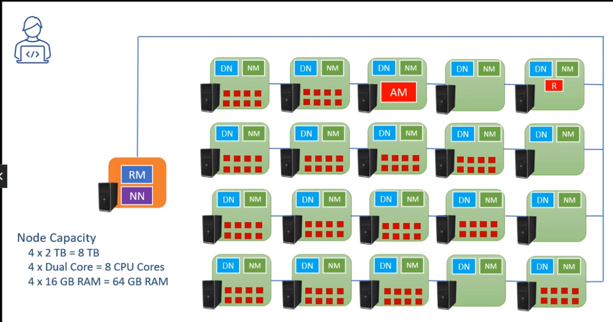

### Hadoop

- A distributed data processing platform
- provides these capabilites
  - YARN: Cluster Resource Manager to manage resource allocation
  - HDFS: Distrbuted Storage to manage data blocks
  - MapReduce: Distributed Computing

#### **Y**et **A**nother **R**esource Manager (YARN)

- known as hadoop cluster Resource Manager
- Has 3 main components:
  - Resource Manager (RM):
    - runs on master node
    - starts a AM container in one of the worker nodes to run applications for e.g. reduce function
    - work with MapReduce framework to execute map function on worker nodes
    - executes the reduce function in a container on a worker node to consolidate outputs
  - Node Manager (NM): send node status report of worker nodes to resource manager in master node
  - Application Master (AM): where the application will run
- YARN container is a bundle of CPU and memory to run applications

#### Hadoop Distributed File System (HDFS)

- Distributed Storage on Hadoop
- Has 2 components
  - Name Node (NN): runs on master node
  - Data Node (DN): runs on worker nodes

##### On COPY

- NN redirect COPY command to DNs
- COPY command split file into small parts and writes them onto DNs
- NN facilitates the process and keep tracks of the metadata

##### on READ

- READ Request goes to NN first, but getting redirected to the target DNs
- The READ API receives the data blocks from the DNs and reassembles the file using metadata from NN

#### MapReduce

- A programming model
  - Map: Parallel processing
    - Read data block
    - Applies logic at block level
    - Map output is sent to Reduce
  - Reduce: Consolidation
    - Receives Map Output
    - Consolidate the results
- A programming framework (outdated, not used)