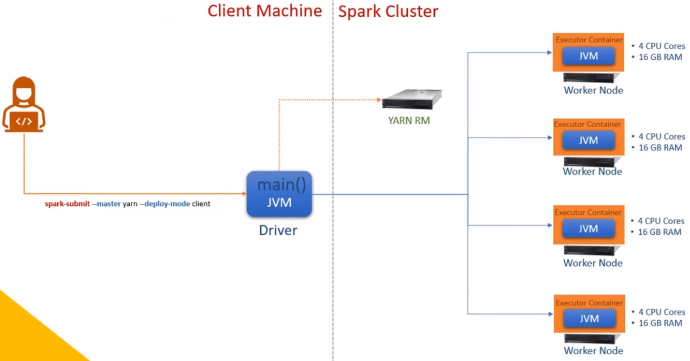
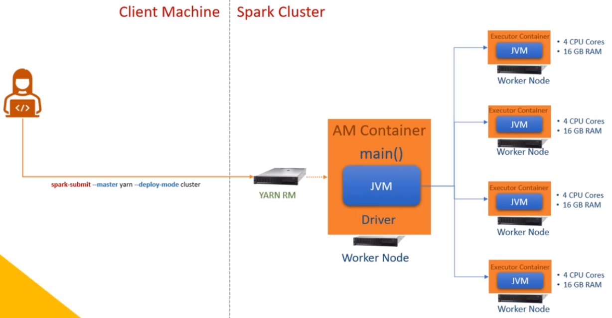

## Spark Execution Model

- Applications need to be package before submit it to the Spark cluster for execution
- There are two ways to execute Spark programs:
  - Interactive Clients i.e spark-shell, Notebooks for exploration
  - Submit Job i.e. spark-submit, Databricks Notebook, Rest API for production cases

### How Spark Apps are executed

- Spark applies a master-slave architecture for every app
- When an app is submitted to the cluster, the Spark engine is going to ask for a container from the cluster manager to start the driver process (master).
- The driver will ask for some more containers to start the executor process (slave) to do the work. Each of these runtime containers will have some dedicated CPU and memory.
- Together the driver and executors are responsible for running the application code
- This entire process happens for each app and each app will have their own dedicated driver and executors and run independently

### Cluster Managers

- There is a variety of cluster managers to use for running the app
  - local[n]: n is the number of threads. One thread, one process
    - Note that the local cluster manager is just a simulation of distributed client-server architecture and is designed for running, testing, and debugging your spark application locally.
  - YARN
    - for running on real spark cluster
  - Kubernetes
  - Mesos
  - Standalone
- The application can be configured to run to use a certain cluster manager

    ``` py
    spark.master = local[3]
    ```

### Deploy Modes

- The application can run in one of the two modes.
  - Client mode: driver runs in client machine.
  - Cluster mode: driver runs in the cluster.

#### Client Mode

<br>



- the spark-submit command will start the driver JVM directly on the client machine.
- Now the driver will reach out to the YARN resource manager requesting executor containers.
- The YARN RM will start executor containers and handover them to the driver.
- The driver will start executors in those containers to do the job.

#### Cluster Mode

<br>



- the spark-submit will reach the YARN RM requesting him to start the driver in an AM container.
- YARN will start your driver in the AM container on a worker node in the cluster.
- Then the driver will again request YARN to start some executor containers and the YARN will start executor containers and handover them to the driver.
- In essence, both driver and executors are running in the cluster
  - driver in AM containers on a worker node
  - executors in executor containers on some worker nodes
- if PySpark app
  - add Pyspark driver in AM containers
  - add Python workers in executor containers

#### Choosing the right deploy mode

##### Cluster Mode

1. For production workloads i.e. long-running jobs
   - For submiting the application to the cluster and let it run.
   - Since the driver and the executors now run on the cluster, once the application is submitted, the client machine is not needed
2. Better performance

- In this mode, the driver is closer to the executors.
- Since the driver and executor communicate heavily, being closer reduces the impact by network latency.

##### Client Mode

1. For interactive workloads
   - for e.g. for interactive clients i.e spark-shell and the notebooks
   - Since the Spark driver process runs locally at your client machine, we can easily comunicate with the driver to get the results and show it to us
2. Easy Exit  
   - if you are quitting your client or you log off from your client machine, then your driver dies and the executors will also die without the driver.
   - As soon as the driver dies, the YARN RM knows that the driver is dead, and the executors assigned to the driver are now orphans.
   - The RM will terminate the executor containers to free up the resources.

