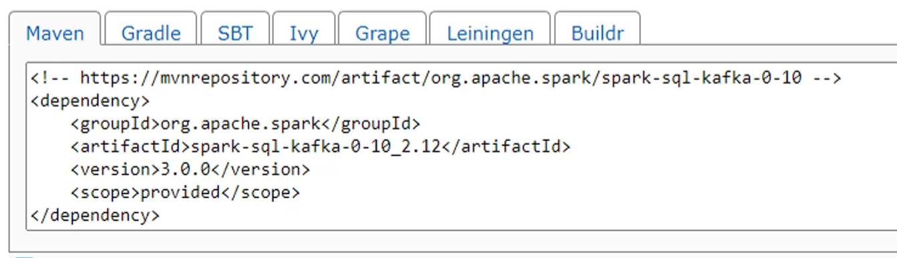

### What is Spark’s JAR Folder?
- The repository of library files that Spark uses during its operations. - These library files or JAR files contain compiled Java classes and associated metadata that encapsulate the core functionalities of Spark. - - The location of the Spark JAR folder varies depending on the Spark installation method and the operating system in use.
    - Usually found in the Spark home directory when working with a solo Spark installation. This method extracts the Spark tarball to the Spark home directory. It is commonly referred to as $SPARK_HOME in Spark’s documentation and shell scripts.
      - Within the Spark home directory, we will find several subdirectories hosting JAR files:
        - `$SPARK_HOME/jars`: This is the primary repository for Spark’s JAR files. We can place the individual JAR files here to include additional libraries, such as the MySQL Connector/J.
        - `$SPARK_HOME/lib`: Some Spark distributions may store the JAR files using this directory.

### [Setting up dependencies](https://blog.devgenius.io/spark-installing-external-packages-2e752923392e)

- Spark SQL and kafka integration is offered by a seperate package, [spark-sql-kafka`](https://mvnrepository.com/artifact/org.apache.spark/spark-sql-kafka-0-10)

- in /conf/spark.defaults.conf file, add `spark.jars.packages
   <groupId>:<artifactId>:<version>,...`
- for e.g. based on the screenshot, `spark.jars.packages     org.apache.spark:spark-sql-kafka-0-10_2.12:3.0.0`
  
- Spark will read this config file and download the required package and related dependencies
> NOTE: No spaces between the package names!! 
- Alternatively, we can do it via code. However, this is not recommended as it's better to keep it outside of application code
  - NOTE: Sometimes this method gets ignored and doesn't work. See [here](https://stackoverflow.com/questions/62106554/why-does-spark-submit-ignore-the-package-that-i-include-as-part-of-the-configura) and [here](https://issues.apache.org/jira/browse/SPARK-21752)

  ```py
  if __name__ == "__main__":
    spark = SparkSession \
        .builder \
        .appName("File Streaming Demo") \
        .master("local[3]") \
        .config("spark.streaming.stopGracefullyOnShutdown", "true") \
        .config("spark.jars.packages", "org.apache.spark:spark-sql-kafka-0-10_2.12:3.0.0") \
        .getOrCreate()
  ```
