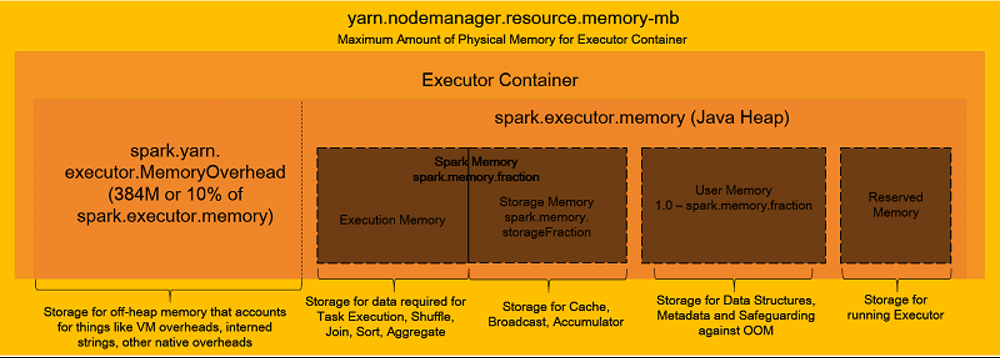
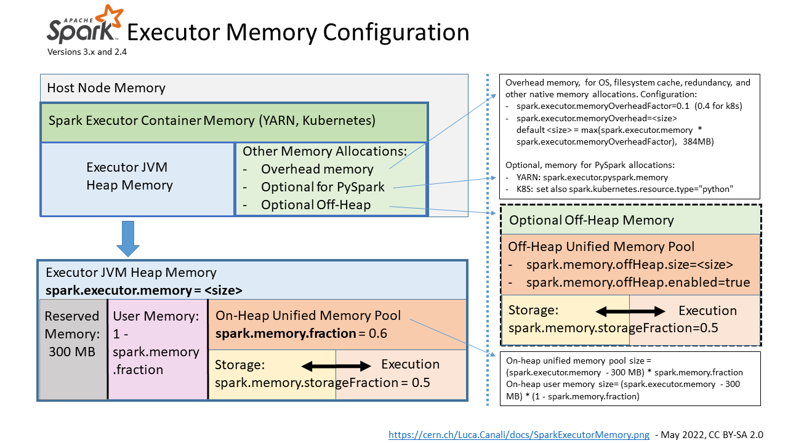

### RECAP: The StartUp Process

- Assume you submitted a spark application in a YARN cluster.
- The YARN RM will allocate an application master (AM) container and start the driver JVM in the container.
- The driver will start with some memory allocated based on what is requested.
- Taking account of the configs for the executor container, the driver requests for the executor containers from the YARN.
  - Config includes memory for the ezecutor container.
- The YARN RM allocates a bunch of executor containers.

### Considerations

#### Allocation Limit

- Since containers run on worker node in the YARN cluster, the amount of memory that can be allocated to the container is bound by the available memory on the worker node
- Before ask memory for the driver or executor memory, check with your cluster admin for the maximum allowed value.
- If you are using YARN RM, you should look for the following configurations.
  - `yarn.scheduler.maximum-allocation-mb`
  - `yarn.nodemanager.resource.memory-mb`

#### Garbage Collection

- For large memory requirements, mixing some on-heap and off-heap might help you reduce garbage collection delays.
- Garbage collection is the process of automatically freeing up memory no longer used by the application,
- Most of the spark operations and data caching are performed in the JVM heap where they perform best. However, the JVM heap is subject to garbage collection.
- Allocating a huge amount of heap memory to your executor might result in excessive garbage collection delays.
- Spark 3.x was optimized to perform some operations in the off-heap memory since it allows for flexible memory management, avoiding GC delays.
- So if you need an excessive amount of memory for your Spark application, it might help you use some off-heap memory instead.

#### Number of Executor Cores

- This determines the maximum number of concurrent threads.
- With each cpu core allocated, the executor gets one slots since 1 thread/core x 1 slot/thread x 1 task/slot.
- If you have too many threads, you will have too many tasks competing for memory.
- If you have a single thread, you might not be able to use the memory efficiently.
- In general, Spark recommends two or more cores per executor, but you should not go beyond five cores.
- More than five cores cause excessive memory management overhead and contention, so they recommend stopping at five cores

### Config Available

#### Driver Memory Allocation

- `spark.driver.memory`
  - Your Spark driver only uses the JVM heap.
  - The YARN RM will allocate memory as specified
- `spark.driver.memoryOverhead`
  - The overhead memory is used by the container process or any other non JVM process within the container.
  - Default value of spark.driver.memoryOverhead = 0.10
  - The YARN RM will allocate 10% of your requested memory or 384 MB, whatever is higher for container overhead.
- Total memory is the sum of the driver memory and its overhead
- Once allocated,
  - Spark driver JVM cannot use more than the allocated `spark.driver.memory` amount
  - Non-JVM workload in the container cannot exceed the allocated `spark.driver.memoryOverhead` amount
  - The total memory becases the physical memory limit for the Spark driver
  - If any of these limits are violated, you will see an OOM exception.

#### Executor Memory Allocation

- `spark.executor.memory` for JVM Heap Memory
  - The heap memory is broken down into three parts.
    - Reserved Memory
      - Spark will reserve 300 MB for the Spark engine itself.
    - `spark.memory.fraction configuration` for split of residual memory between Spark Memory and User Memory (default: `60%`)
      - User Memory
        - used for non-dataframe operations i.e. user-defined data structures such as hash maps, spark internal metadata, user-defined functions, RDD information, RDD operations
        - Memory allocated = (100% - `spark.memory.fraction configuration`) * (`spark.executor.memory` - Reserved Memory)
      - Spark Memory
        - for DataFrame operations and caching.
        - Memory allocated = `spark.memory.fraction configuration` * (Total Heap Memory - Reserved Memory)
        - **Note**: Can increase the percentage but not too much as Spark needs some memory leftover for User memory for metadata and other internal things
        - `spark.memory.storageFraction` for split into storage and executor memory (default: `50%`)
          - Storage memory
            - for caching DataFrames
            - for longer-term operations; once cached, the data is stored here as long as the executor is running or until the data is un-cached
          - Executor memory
            - for performing dataframe computations for e.g. buffering data needed for joins/aggregation
            - for short-lived operation; memory is freed as soon as execution is done
            - `Prior Spark 1.6`: assigning memory to each core is done via static memory management where it's split equally among its cores.
            - `Spark 1.6 onwards`: A unified memory manager (UMM) is implemented which tries to allocate all available memory among the active tasks
              - the task will request for memory and the UMM will allocate some memory from the memory pool
              - If there's no more available executor memory,  the memory manager can also borrow memory from the storage memory pool if there's some free storage memory available.
              - The opposite is true too. If we want to cache more data than the storage memory pool can allowed but there is free memory in the executor memory pool, the UMM will borrow some over to help with the caching.
              - That said, dataframe computations have first priority over executor memory.
              - Hence, if the executor now needs the borrowed executor memory for computation, the UMM will evict the cached dataframes and spill them to the disk to make more space for the executor.
              - if the executor still needs more memory after consuming all the executor memory
                - Given that the `spark.memory.storageFraction` boundary is rigid and there is no free storage memory to borrow, the UMM will try to spill some things over to disk
                - if that is not possible, we have an OOM exception
- `spark.executor.memoryOverhead` for overhead memory (Default: 10%)
  - The overhead memory is used for a bunch of things.
  - Used for network buffers, shuffle exchange or reading partition data from remote storage etc.
- `spark.memory.offHeap.size` for Optional Off Heap Memory
  - `spark.memory.offHeap.enabled=true` to enable the off-heap memory feature (default: `false`)
  - Used as an indirect method of increasing the executor and storage memory pools.
- `spark.executor.pyspark.memory` for Optional Pyspark Memory
  - PySpark memory is needed for the Python workers if you are using PySpark
  - Python workers cannot use JVM heap memory so they use off-heap overhead memory.
- Total memory is the sum of the following.
  - Overhead Memory,
  - Heap Memory,
  - Off Heap Memory
  - Pyspark Memory
- Once allocated,
  - Spark executor JVM cannot use more than the allocated `spark.executor.memory` amount
  - Non-JVM workload in the container cannot exceed the allocated `spark.executor.memoryOverhead` amount
  - The total memory becases the physical memory limit for the Spark executor
  - If any of these limits are violated, you will see an OOM exception.
  - If your PySpark consumes more than what can be accommodated in the overhead, you will see an OOM error.

