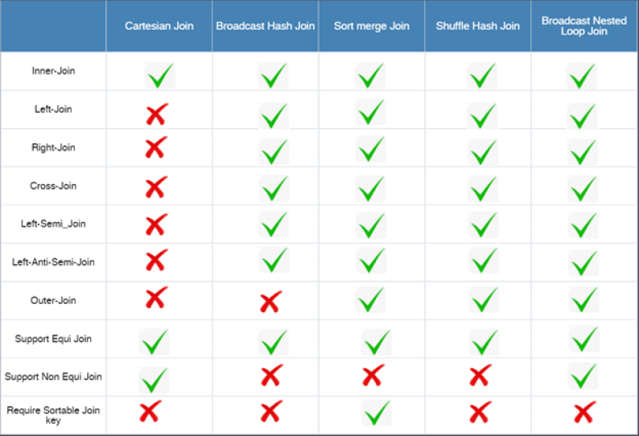
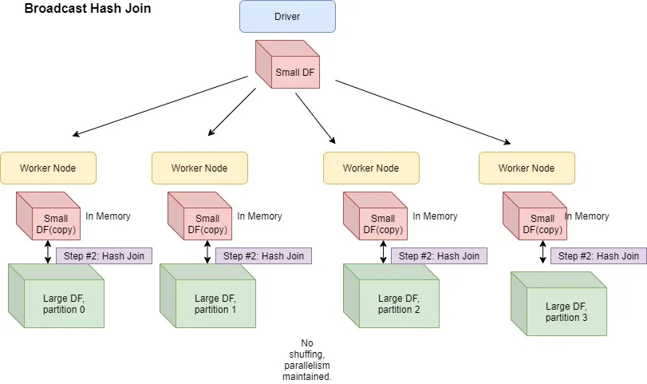
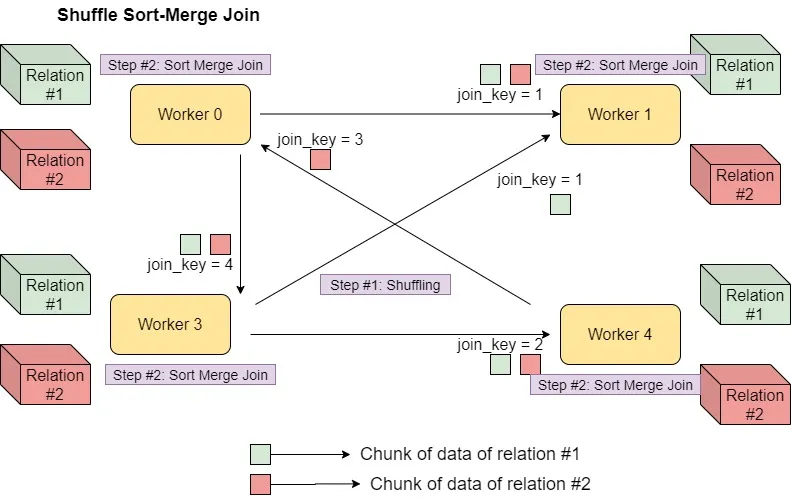

https://towardsdatascience.com/about-joins-in-spark-3-0-1e0ea083ea86

## Spark Join Strategies

### Selecting a Join Strategy

-   Spark chooses a particular mechanism for executing a Join operation based on the following factors:
    -   Configuration parameters
    -   Join hints for e.g. `broadcast()`, `merge()`, `shuffle_hash()`, `shuffle_replicate_nl()`
    -   Size of input data sets
    -   Join Type
    -   Equi or Non-Equi Join Conditions



#### Equivalence Join Condition

Look at the join hints in the following order:

-   `broadcast()` Hint — Pick Broadcast Hash Join if join type is supported.
-   `merge()` Hint — Pick Sort-Merge to join if join keys are sortable.
-   `shuffle_hash()` Hint — Pick Shuffle Hash Join if join type is supported.
-   `shuffle_replicate_nl()` Hint — Pick Cartesian Product if join type is inner like.
-   No Hint
    -   If one of the datasets is small enough to be broadcasted and join type is supported then pick Broadcast Hash Join.
    -   If join keys are sortable then pick Sort Merge Join.
    -   If one of the datasets is small enough to build a Hash table, and spark.sql.join.preferSortMergeJoin=false, choose Shuffle Hash Join.
    -   If the join type is inner type, then pick Cartesian Product Join.
    -   Call the Broadcast Nested Loop Join if none of the options satisfies.

#### Non-Equivalence Join Conditions

Look at the join hints in the following order:

-   Broadcast Hint — Pick the Broadcast Nested Loop Join.
-   Shuffle Replicate NL Hint — Pick Cartesian Product if the join type is inner like.
-   No Hint
    -   Pick broadcast nested loop join if one side is small enough to broadcast.
    -   Pick cartesian product if join type is inner like.
    -   Pick broadcast nested loop join as the final solution. It may OOM but we don’t have any other choice.

### Join Strategies

#### Hash Join

-   Supports ‘=’ join condition only.
-   Applied at the per node level i.e. all partitions on the nodes where the dataset is available.
-   Hash Join also requires the data to be partitioned correctly.

#### Shuffle

-   All records are identified by the join key and they are made available in the map exchange to be picked up by the Spark framework. The map exchange is like a record buffer at the executor.
-   Now the Spark framework will pick these records and send them to the reduce-exchange.
-   A reduce-exchange is going to collect all the records for the same key i,e, all the records for the key-value 01 will go to the same exchange. These exchanges are known as shuffle partitions.

##### How it works

-   Two Step Process
    1. Hash Join is performed by first creating a Hash Table based on join_key of smaller dataset. The creation of the hash table improves the searching.
    2. Loop over the larger dataset and based on the join key attribute, search the hash value in the smaller dataset

#### Broadcast Hash Join

-   Broadcast Hash join is quite useful when **one of the datasets is small** usually less than 10 MB (default)
-   It employs a simple strategy of broadcasting the smaller dataset to the worker nodes thus saving the Shuffle cost.
-   Usually faster than other join strategies when the broadcast size is small
-   Support for all join types(inner, left, right) except full outer joins with ‘=’ join condition only
-   This join is also called Map End Join.

##### How it works

<br>



-   The driver first gets the dataset from the executor side
-   The driver then broadcasts the datasets to all the worker nodes where the partitions for the larger dataset are present.
-   Hence, the driver as well as executor nodes should have enought memory to house the broadcasted dataset.

##### Configs Available

-   `spark.sql.autoBroadcastJoinThreshold`

    -   Spark uses the Broadcast Hash Join when one of the data frame’s size is less than the threshold set in `spark.sql.autoBroadcastJoinThreshold`.
    -   The default value is 10 Mb and has a max limit of 8GB. It can be configured using the following code

    ```py
      spark.conf.set("spark.sql.autoBroadcastJoinThreshold", 100 * 1024 * 1024)
    ```

> **Word of Caution!!**
>
> -   The table is cached on the driver node as well on the executor nodes
> -   The broadcasting table can become a network-intensive operation.
> -   By increasing the number of executors, we are increasing the broadcasting cost too.
> -   An increase in size of the broadcasted table may lead to OOM or performance degradation.

-   `spark.sql.broadcastTimeout`

    -   Broadcasting large datasets can also lead to timeout errors.
    -   `spark.sql.broadcastTimeout` sets the maximum time that a broadcast operation should take, past which the operation fails.
    -   The default timeout value is 5 minutes, but it can be set as follows:

    ```py
      spark.conf.set("spark.sql.broadcastTimeout", time_in_sec)
    ```

#### Shuffle Hash Join

-   Shuffle Hash Join’s performance is the best when the data is **distributed evenly with the key you are joining** and you have an adequate number of keys for parallelism.
-   It is an expensive join as it involves both shuffling and hashing. Also, maintaining a hash table requires memory and computation.
-   The Sort-merge Join is the default Join and is preferred over Shuffle Hash Join.
-   To use the Shuffle Hash Join,
    -   `spark.sql.join.preferSortMergeJoin` needs to be set to false
    -   one side of the join is at least three times smaller than the other side
    -   the average size of each partition is smaller than the autoBroadcastJoinThreshold.
-   The join keys need NOT be sortable and so has the potential to be faster than Sort Merge Join since the cost to build a hash map is less than sorting the data
-   Supports all join types except full outer joins with ‘=’ join condition only

##### How it works

<br>


-   Shuffle Hash Join is performed in two steps:
    -   Shuffling: For data from the Join tables are partitioned based on the Join key, It moves the data across partitions such that the same Join keys of the record assigned to the corresponding partitions.
    -   Hash Join: A classic single node Hash Join algorithm is performed for the data on each partition.

##### vs Broadcast Hash Join

-   Memory requirement on executors is relatively less in the case of ‘Shuffle Hash Join’ as compared to ‘Broadcast Hash Join’.
-   This is due to the fact that the hash table is being built only on a certain partition of smaller input data set.
-   So, if you provision a large number of output partitions and you have a large number of executors with decent memory configuration, you can achieve higher efficiency for your Join operation with ‘Shuffle Hash Join’.
-   However, the efficiency would be less than the ‘Broadcast Hash Join’ if Spark needs to execute an additional shuffle operation on one or both input data sets for conformance to output partitioning.

#### Shuffle Sort Merge Join

-   SMJ performs better than other joins most of the time and has a very scalable approach as it does away with the overhead of hashing and does not require the entire data to fit inside the memory.
-   It involves shuffling of data to get the same Join key with the same worker, and then performing Sort-merge Join operation at the partition level in the worker nodes.
-   This is the default join strategy in Apache Spark since Spark 2.3. It can be disabled using `spark.sql.join.preferSortMergeJoin=false`.
-   Note that the join keys need to be sortable (for the sort-merge join)
-   Supports all join types with ‘=’ join condition only

-   The shuffle and sort are very expensive operations and in principle, to avoid them it’s better to create Data frames from correctly bucketed tables. This makes join execution more efficient.

##### How it works

<br>



-   It has 3 phases:
    -   Shuffle Phase: Both large tables will be repartitioned as per the Join keys across the partitions in the cluster.
    -   Sort Phase: Sort the data within each partition parallelly.
    -   Merge Phase: Join the sorted and partitioned data. It is merging of the dataset by iterating over the elements and joining the rows having the same value for the Join keys.

##### Comparison

-   Computationally less efficient when compared to ‘Shuffle Hash Join’ and ‘Broadcast Hash Join’
-   the memory requirements on executors for executing ‘Sort Merge Join’ are significantly lower than the ‘Shuffle Hash’ and ‘Broadcast Hash’.
-   Also, similar to ‘Shuffle Hash Join’, if input data sets don't conform to desired output partitioning, then shuffle operation of one or both the input data sets, as the case may be, adds to the overhead of the ‘Sort Merge Join’ execution.

#### Cartesian Join

-   Cartesian Join is used exclusively to perform cross join between two input data sets. Cross Join computes a cartesian product of 2 tables.
-   When the Join type is inner like and there are no Join keys present, the Cartesian Join will be selected.
-   If we want to use Cartesian Join, we have to either
    -   set the spark.sql.crossJoin.enabled=true in our Spark session builder object or
    -   set it for Spark-shell : spark-shell — conf spark.sql.crossJoin.enabled=true
    -   otherwise Spark will throw an AnalysisException.
-   Supports only inner join types with both equivalence and non-equivalence join conditions.
-   Drawback of Cartesian Join explodes the number of output partitions. But if you require cross Join, Cartesian is the only mechanism.

##### How it works

The number of output partitions is always equal to the product of the number of partitions of the input data set.
Each output partition is mapped to a unique pair of partitions, each pair comprising of one partition from one input dataset and other partition from the other input dataset.
For each of the output partition of the output data set, the data is computed by doing a cartesian product on data from two input partitions mapped to the output partition.

#### Broadcast Nested Loop Join

-   This is generally, a fallback option when no other join type can be applied for w.g. if the join condition and hint type are not mentioned, then this join is chosen.
-   It is computationally least efficient since a nested loop is executed to compare the two data sets.
-   It is memory intensive since one of the input data set needs to be broadcasted to all the executors.
-   Supports all join types with either Equi-Joins or Non-Equi-Joins

##### How it works

```py
# Nested Loop Join
for record_1 in relation_1:
  for record_2 in relation_2:
    # join condition is executed
```

-   One of the input data set is broadcasted to all the executors.
-   After this, each partition of the non-broadcasted input data set is joined to the broadcasted data set using the standard Nested Loop Join procedure to produce the output joined data.
-   To improve performance, Spark uses BroadcastNestedLoopJoinExec operator that broadcasts the appropriate side of the query
    -   The Left side is broadcasted in the right outer Join.
    -   The Right side is broadcasted in a left outer, left semi, and left anti Join.
    -   In an inner-like Join.
    -   In other cases, we need to scan the data multiple times, which can be rather slow but at least some chunk of data is broadcasted
