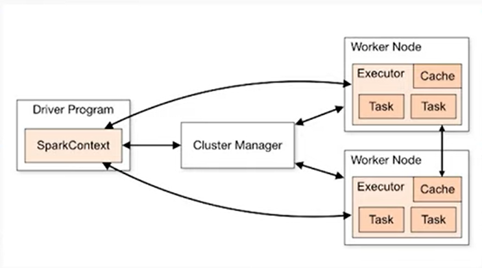

- [Documentation](https://spark.apache.org/docs/2.1.0/api/python/index.html)
- [Tips on using Pyspark](https://www.confessionsofadataguy.com/new-to-pyspark-do-this-not-that/)

- [ETL Best Practices](https://alexioannides.com/2019/07/28/best-practices-for-pyspark-etl-projects/)
- [Pyspark with Delta Lake](https://towardsdatascience.com/hands-on-introduction-to-delta-lake-with-py-spark-b39460a4b1ae)
- [Official Spark Guide](https://spark.apache.org/docs/latest/sql-programming-guide.html)

- [Calling REST_API](https://medium.com/geekculture/how-to-execute-a-rest-api-call-on-apache-spark-the-right-way-in-python-4367f2740e78)
- <https://medium.com/nerd-for-tech/apache-spark-visual-intro-9eb3fd2709f9>

- [spark-submit job template](https://github.com/js58/pyspark-template/tree/main)
- https://towardsdatascience.com/successful-spark-submits-for-python-projects-53012ca7405a
- https://mallikarjuna_g.gitbooks.io/spark/content/spark-standalone-master.html

- [Metastore](https://medium.com/@sarfarazhussain211/metastore-in-apache-spark-9286097180a4)

## Spark

### What is Spark

- Spark is a distributed data processing framework.

### The SparkSession Object

- Recap: Every Spark program will start a driver. See [[tools.transform.spark.config.deploy_mode]]
- The driver process is initiated via the SparkSession object,
  - In some cases, for e.g. spark-shell, this is done automatically and assigned to the variable `spark`
  - With Spark apps, we have to create a SparkSession object manually: `SparkSession.builder().getOrCreate()`
- FYI SparkSession is a Singleton object so there will only be one active SparkSession
- For configuring SparkSession, see [[tools.transform.spark.config]]

#### SparkContext vs SparkSession

link: <https://www.sparkcodehub.com/pyspark-sparksession-and-sparkcontext>

``` py
from pyspark import SparkContext
from pyspark.sql import SparkSession

sc = SparkContext('local', 'PySparkIntro')
spark = SparkSession.builder.appName('PySparkIntro').getOrCreate()
```



- `SparkContext`
  - is the main entry point for using the Spark Core functionalities.
  - It connects the cluster manager and coordinates resources across the cluster.
  - meant for fine grained control for low-level RDD operations
- `SparkSession`
  - is a unified entry point for DataFrame and Dataset API, Structured Streaming, and SQL operations.
  - It encapsulates SparkContext and several other contexts, such as HiveContext and SQLContext, which were used in previous Spark versions
  - Meant for high level processing tasks

### Spark DataFrame

- Spark DataFrame is a two-dimensional table-like immutable data structure similar to the Pandas DataFrame.
- They are a distributed table with named columns and well-defined schema i.e. each column has a specific data type such as integer, float, string, timestamp, etc.
  - Tip: To get the schema, use the `.printSchema()` method
- Visualizing the DataFrame (presented like a database table) can be done using the `.show()` method
- Most transformations are performed on DataFrames

## Data Cleaning / Preprocessing

``` py

# dealing with missing values
data_with_missing = [
    ('Alice', 28, 45000),
    ('Bob', None, 60000),
    ('Cathy', 23, None)
]
df_missing = spark.createDataFrame(data_with_missing, ['Nmae', 'Age', 'Salary'])
mean_age = df_missing.select('Age').agg('Age':'avg')).collect()[0][0]
df_cleaned = df_missing.na.fill(mean_age, subset=['Age'])
df_cleaned.show()


# feature scaling
from pyspark.ml.feature import MinMaxScaler, StandardScaler
from pyspark.ml.feature import VectorAssembler

df = spark.createDataFrame(data, ['Name', 'Age', 'Salary'])
assembler = VectorAssembler(inputCols = ['Age'. 'Salary'], outputCol = 'features')
# combines the row values into an array.
data_for_scaling = assembler.transform(df)
data_for_scaling.show()

scaler_min_max = MinMaxScaler(inputCol = 'features', outputCol = 'scaled_features')
df_min_max = scaler_min_max.fit(data_for_scaling).transform(data_for_scaling)
df_min_max.show()

scaler_std = StandardScaler(inputCol = 'features', outputCol = 'scaled_features', withStd=True, withMean= True)
df_std = scaler_std.fit(data_for_scaling).transform(data_for_scaling)
df_std.show()

```

## Pyspark for Exploratory Data Analysis

```py

data = [
    ('Alice', 28, 45000),
    ('Bob', 36, 60000),
    ('Cathy', 23, 35000)
]
df = spark.createDataFrame(data, ['Name', 'Age', 'Salary'])


# =================Summary Stats=================
from pyspark.sql.functions import mean, stddev

summary_stats = df.describe(['Age','Salary'])
summary_stats.show()


# ===================Data Viz=============
import matplotlib as plt
import pandas as pd

# Converting to pandas dataframe
pd_df = df.toPandas()

# Creating a scatter plot
plt.scatter(pd_df['Age'], pd_df['Salary'])
plt.xlabel('Age')
plt.ylabel('Salary')
plt.title('Age vs Salary')
plt.show()

plt.hist(pd_df['Age'], bins = 10, edgecolor= 'black')
plt.xlabel('Age')
plt.ylabel('Frequency')
plt.title('Age Distribution')
plt.show()


# =================== Correlation Analysis =============
corr_matrix = df.stat.corr('Age', 'Salary')
print(f'Correlation between Age and Salary: {corr_matrix})

```

## Data Transformation

```py
from pyspark.sql.functions import col

df_transformed = df.withColumn('increasedSalary', col['Salary'] * 1.1)
df_transformed.show()

# String manipulation
from pyspark.sql.function import concat, lit

df_transformed = df.withColumn('ModifiedName', concat(col['Name'], lit('-Employee')))
df_transformed.show()

# Filter data
df_filtered = df.filter(col['Age'] > 25)
df_filtered.show()

# Aggregating Data
from pyspark.sql.functions import avg
avg_salary = df.agg(avg(col['Salary'])).collect()[0][0]
print(f'Average Salary: {avg_salary}')

# Group By
from pyspark.sql.function import avg, max

grouped_data = df.groupBy('Age').agg(avg('Salary'), max('Salary'))
grouped_data.show()


# Window functions
from pyspark.sql.functions import Window
from pyspark,sql.functions import sum

window_spec = Window.orderBy('Age')
df_with_cumsum = df.withColumn('CumulativeSalary', sum('Salary').over(window_spec))
df_with_cumsum.show()

```

## User Defined Functions

```py
def add_prefix(name):
    return 'Mr.' + name

from pysparl.sql.functions import udf
from pyspark.sql.types import StringType

# register udf, specifying return type as string
add_prefix_udf = udf(add_prefix, StringType())

# apply udf
df_with_prefix = df.withColumn('PrefixedName', add_prefix_udf('Name'))
df_with_prefix.show()


def calculate_total_income(age, salary):
    return age * salary

from pyspark.sql.types import IntegerType
calculate_total_income_udf = udf(calculate_total_income, IntegerType())
df_with_total_income = df.withColumn('Total_Income', calculate_total_income_udf('Age', 'Salary'))
df_with_total_income.show()
```

---

Think of Apache Spark like a basketball game! 

There are 4 pieces: 

- the driver who is the coach 
- the data which is the basketball 
- the executors who are the players 
- the query plan which is the play 


When a Spark job initially starts, the coach reads the play and tells the executors where to get the ball. 

Only when a shot is taken (I.e. data is output somewhere), does the basketball do anything that matters. (in tech speak: Spark is lazily executed) 

Things can break though: 

- a player is asked to juggle 40 basketballs and fails. 
This happens in Spark when there is data skew. Executors fail and you need to manage skew better. An option here is to have the coach distribute the basketballs more equitable with random numbers. (this is a technique called salting the GROUP BY) 

- the play is too large and too complicated and the coaches head explodes 
This is driver OOM that usually happens when half way through a play, a player starts throwing basketballs at the coach and asking him what they should do next. This is when you call collect(). The coach can handle an extremely light amount of basketballs only! 

- the play takes too long and the shot clock (I.e. SLA) kills the job 
Sometimes you don’t have enough initial players on the team for the job to run successful. A good strategy here is to bump up spark.sql.shuffle.partitions because unlike basketball each team can have more than 5 players! 