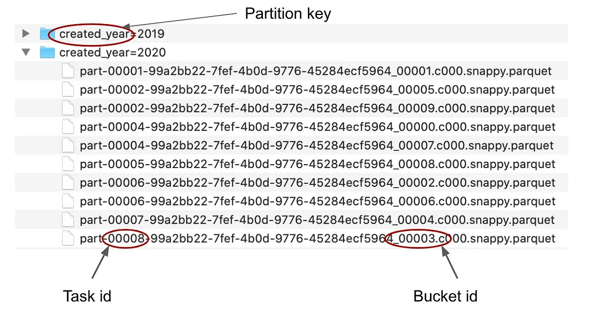
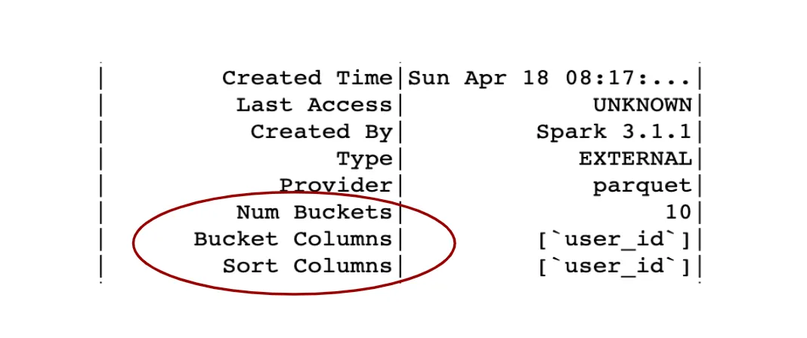

https://www.youtube.com/watch?v=1kWl6d1yeKA

## [Bucketing](https://towardsdatascience.com/best-practices-for-bucketing-in-spark-sql-ea9f23f7dd53)

### What is bucketing?

- Bucketing in Spark is to organize data in the storage system in a particular way so it can be leveraged in subsequent queries which can become more efficient by avoiding the shuffle in queries with joins and aggregations
  - Queries with sort-merge join or shuffle-hash join and aggregations or window functions require rows that have the same value of the joining/grouping key to be in the same partition.
  - To satisfy this requirement, data is physically moved from one executor to another in the process called shuffling
- With bucketing, we can shuffle the data in advance and save it in this pre-shuffled state.
- After reading the data back from the storage system, Spark will be aware of this distribution and will not have to shuffle it again.

### Implementation

- Bucketing can be done via the `bucketBy(<N_BUCKETS>)` method

``` py
  df.write
  .mode(saving_mode)  # append/overwrite
  .bucketBy(n, field1, field2, ...)
  .sortBy(field1, field2, ...)
  .option("path", output_path)
  .saveAsTable(table_name)
```

- **Data needs to be save as a SQL table to ensure that the metadata is saved in the metastore** (if the Hive metastore is correctly set up) and Spark can pick the information from there when the table is accessed.
- Together with bucketBy, we can call also sortBy to sort each bucket by the specified fields. Calling sortBy is not required, bucketing will work also without the sorting. The other way around will not work though.


### The Bucketing Algorithm

- Roughly speaking, Spark is using a hash function that is applied on the bucketing field and then computes this hash value modulo number of buckets that should be created (hash(x) mod n).
- This modulo operation ensures that no more than the specified number of buckets are created.
- For e.g. suppose after applying the hash function we get these values: (1, 2, 3, 4, 5, 6 ) and we want to create 4 buckets, so we will compute modulo 4. Modulo function returns the remainder after integer division:

    ``` raw
    # remainder after the integer division
    1 mod 4 = 1  
    2 mod 4 = 2
    3 mod 4 = 3
    4 mod 4 = 0
    5 mod 4 = 1
    6 mod 4 = 2

    # Using the computed number, we are able to distribute these six values into four buckets
    (1, 2, 3, 4, 5, 6 ) -> (1, 2, 3, 0, 1, 2)
    ```

- To be more exact, to ensure positive values, a positive modulo function is used

    ``` py
    b = value mod n
    if b < 0:
    b = (b + n) mod n

    # An example  
    n = 4
    value = -9
    b = value mod n = -9 mod 4 = -1

    # be is negative so we continue
    b = (b + n) mod n = (-1 + 4) mod 4 = 3 mod 4 = 3
    # So the value -9 will belong to bucket number 3.
    ```

- The hash function that Spark is using is implemented with the MurMur3 hash algorithm and the function is actually exposed in the DataFrame API (see in docs) so we can use it to compute the corresponding bucket if we want:

  ``` py
    from pyspark.sql.functions import hash, col, expr
    (
    spark.range(100) # this will create a DataFrame with one column id
    .withColumn("hash", hash(col("id")))
    .withColumn("bucket", expr("pmod(hash, 8)")) # suppose distributing among 8 buckets
    )
  ```

### Advantages of bucketing

- The main goal of bucketing is to speed up queries and gain performance improvements.
- There are two main areas where bucketing can help,
  - Avoid shuffle in queries with joins and aggregations,
  - Reduce the I/O with bucket pruning.
  
#### Shuffle-free joins

- When joining two tables and neither are particularly small, Spark will have to make sure both tables are distributed on the cluster in the same way (according to the joining key) and will therefore shuffle the data (both tables will be shuffled).
- If both tables are bucketed by the joining key into the same number of buckets, Spark will read the data on the cluster with this specific distribution so it doesn’t require additional repartitioning and shuffle i.e. the Exchange operator will no longer be present in the plan

#### One-side shuffle-free join: if one side is bucketed and the other is not

- If the number of buckets is greater or equal to the number of shuffle partitions, Spark will shuffle only one side of the join — the table that was not bucketed.
- if the number of buckets is less than the number of shuffle partitions, Spark will shuffle both tables and will not leverage the fact that one of the tables is already well distributed.
  - To ensure that the bucketing is leveraged, we can:
    1. Set the number of shuffle partitions to the number of buckets (or smaller)

        ``` py
        # if tableA is bucketed into 50 buckets and tableB is not bucketed
        spark.conf.set("spark.sql.shuffle.partitions", 50)
        tableA.join(tableB, joining_key)
        ```

    2. Repartition the tableB into partitions the same number of buckets tableA is bucketed into by explicitly calling repartition as follows:

        ``` py
        # Suppose tableA was bucketed into 50 buckets
        tableA.join(tableB.repartition(50, joining_key), joining_key)
        ```

- The default number of shuffle partitions is 200 and it can be controlled with this configuration setting:

    ``` py
    spark.conf.set("spark.sql.shuffle.partitions", n)
    ```

#### Tables with different bucket numbers

##### Before 3.1

- both tables will be shuffled unless the number of shuffle partitions is equal to or less than the number of buckets of the bigger table in which we get a one-side shuffle-free join.
- For e.g. if tableA has 50 buckets, tableB has 100, and the number of shuffle partitions is 200 (default),  both tables will be shuffled into 200 partitions.
- if the number of shuffle partitions is set to 100 or less, only the tableA will be shuffled into 100 partitions.
- Similarly, we can also repartition one of the tables to the number of buckets of the other table in which case also only one shuffle would happen during the execution.

##### In Spark 3.1.1

- A new feature was implemented which can coalesce the larger number of buckets into the smaller one if it bucket numbers are multiples of each other.
- This feature is by default turned off and can be controlled with `spark.sql.bucketing.coalesceBucketsInJoin.enabled`.
- So if we turn it on and have again tableA bucketed into 50 buckets, tableB into 100, the join will be shuffle-free because Spark will coalesce tableB into 50 buckets so both tables will have the same number and this will happen regardless of the number of shuffle partitions.

#### What about the sort?

##### Before Spark 3.0

- If one file per bucket, can skip the Sort operation from the join plan since Spark was sure that the data is sorted after reading it on the cluster and indeed the final plan was Sort-free.
- if there were more files per bucket, Spark couldn’t guarantee that the data is globally sorted and thus kept the Sort operator in the join plan
- (See the section Bucketing from a Data Engineer perspective below to learn how to achieve exactly one file per bucket.)

##### In Spark 3.0

- Tradeoff between two optimizations
  1. Check if one file per bucket by listing all the files
       - Can be controlled via `spark.sql.legacy.bucketedTableScan.outputOrdering`
  2. Have the Sort operation in the sort-merge join plan all the time
- By default, the check for one file per bucket is set to False and turned off as it was thought to be too expensive (if there were too many files).

#### Shuffle-free aggregations

- Aggregations also require correct distribution of the data on the cluster, achieved by shuffling the data i.e.groupbys, window functions
- However, shuffling can be avoided through bucketing the data

``` py
# Note: both queries will be shuffle-free if the tableA is bucketed by the field user_id. 
# this requires partial shuffle if tableA is not bucketed
  tableA
  .groupBy('user_id')
  .agg(count('*'))

# this requires full shuffle if tableA is not bucketed
  tableA
  .withColumn('n', count('*').over(Window().partitionBy('user_id')))
```

#### Bucket pruning

- Bucket pruning is a feature that was released in Spark 2.4
- Meant to reduce I/O if a filter is used on the field by which the table is bucketed.
- Suppose we have this query: `spark.table('tableA').filter(col('user_id') == 123)`
  - If table is not bucketed, full table scans to find such records
    - if table is large, it can take many tasks to do the job
  - if table is bucketed, only the bucket with the data will be scanned
    - Each file name has a specific structure and contains information about the bucket to which it belongs, and also which task produced the file
    - if table is large, bucket pruning can lead to a huge speedup
  


### Disadvantages of bucketing

- There is actually one consequence of bucketing that is good to keep in mind and it is parallelization during execution.
- Querying a table bucketed into n buckets will query result in the first stage of the resulting job will have exactly n tasks.
- if the table is not bucketed or the bucketing is turned off, a number of tasks can be very different because Spark will try to split the data into partitions to have approximately 128 MB per partition (this is controlled by configuration setting spark.sql.files.maxPartitionBytes) so the tasks have reasonable size and don’t get into troubles with memory.

#### Data Spillage

- the buckets may become too large and cause data spillage
- To resolve such issues, turn the bucketing off to allow Spark to create more partitions
- This is useful especially if the query doesn’t do any operations that could directly leverage the distribution provided by bucketing.

##### In Spark 3.1.1

- A new feature that disregards the bucketing in situations where bucketing is not helpful based on the query plan
- This feature is by default turned on and can be controlled by spark.sql.sources.bucketing.autoBucketedScan.enabled configuration setting.

### Working with Bucketing

#### Is the table bucketed?

- To see if and how a table is bucketed we can simply check the details about the table by calling a SQL statement

    ``` py
    # Be aware that it might be needed to show more rows to see the bucketing info
    spark.sql("DESCRIBE EXTENDED table_name").show(n=100)
    ```

    

#### Is bucketing enabled?

- To check if bucketing is enabled
- This configuration setting can be used to control if bucketing is on or off.

    ``` py
    # if it return true, bucketing is enabled
    spark.conf.get("spark.sql.sources.bucketing.enabled")
    ```

#### Is the bucketing leveraged in my query?

- If a table is bucketed the information about it is saved in metastore.
- If we want Spark to use it we need to access the data as a table (this will make sure that Spark gets the information from the metastore):

    ``` py
    # Spark will use the information about bucketing from metastore
    df = spark.table(table_name)

    # Hive metastore is not queried here
    # Spark will not use the information about bucketing
    # with no info abt bucketing, bucketing will not be used
    df = spark.read.parquet(path_to_data)
    ```

- we can check the query plan and see if there are Exchange operators in the plan in places where we want to avoid them.

### Can I help Spark?

- Usually, if the tables are bucketed in the same number of buckets, the bucketing will work out of the box.
- But there are some cases in which Spark will fail to leverage bucketing and we can actually help to make it work.
- To get an idea, let’s see some of these situations.
  1. Before Spark 3.0, if the bucketing column has a different name in two tables that we want to join and we rename the column in the DataFrame to have the same name, the bucketing will stop working.
       - For e.g., tableA is bucketed by user_id, and tableB is bucketed by userId, the column has the same meaning (we can join on it), but the name is different (user_id vs userId). The bucketing will not be fully leveraged
       - This issue was fixed in Spark 3.0 so renaming the column is no longer a problem.

      ``` py
      # The bucketing information is discarded because we rename the
      # bucketed column and we will get extra shuffle
      tableA
      .withColumnRenamed('user_id', 'userId')
      .join(tableB, 'userId')
      
      # To make it work, we need to keep the original names:
      # Here bucketing will work
      tableA
      .join(tableB, tableA['user_id'] == tableB['userId'])
      ```

  2. The data types of the joining columns need to be the same.

     - for e.g. tableA is bucketed by user_id which is of integer type, tableB is also bucketed by user_id, but it is of long type and both tables are bucketed into 50 buckets.
     - In this situation the data types of the joining column are different in each table, so Spark will have to cast it, will discard the bucketing information and both tables will be shuffled:
     - As you can see we explicitly convert the data type to be the same in both tables and then repartition the changed table into the same number of partitions as is the other table. The shuffle will happen only on this side where we repartition it, the other table will be shuffle-free. This basically becomes equivalent to the situation in which only one table is bucketed and the other is not.

     ``` py
     # both tables will be shuffled if user_id has different data type
     # in both tables

     tableA.join(tableB, user_id)

     # Nevertheless, we can help Spark to achieve at least one-side shuffle-free join as follows:
       tableA
       .withColumn('user_id', col('user_id').cast('long'))
       .repartition(50, 'user_id')
       .join(tableB, 'user_id')
     ```

  3. When using a user-defined function (UDF) in a query with a join, that UDF will discard information about bucketing,
     - if we call the UDF before the join, it will lead to the same situation as if only one table is bucketed.
     - Either both tables will be shuffled, or we will have one-side shuffle-free join if we repartition the table or if we set the number of shuffle partitions to the number of buckets:

        ``` py
        # Spark will shuffle both tables because of the UDF
        tableA.withColumn('x', my_udf('some_col'))
        .join(tableB, 'user_id')

        # One-side shuffle-free join
        tableA.withColumn('x', my_udf('some_col'))
        .repartition(50, 'user_id') # assuming we have 50 buckets
        .join(tableB, 'user_id')
        
        # One-side shuffle-free join
        # set number of shuffle partitions to number of buckets (or less)
        spark.conf.set('spark.sql.shuffle.partitions', 50)(
            tableA.withColumn('x', my_udf('some_col'))
            .join(tableB, 'user_id')

        # To totally avoid the shuffle, we can simply call the UDF after the join
        tableA
        .join(tableB, 'user_id')
        .withColumn('x', my_udf('some_col'))
        ```

### Bucketing Considerations

- Bucketing need to be considered similarly to partitioning which is another way how to organize data in the file system.

#### Controlling the number of created files

- Each task in the last stage of the Spark job will **create one file for each bucket** for which it carries data.
- Suppose the data on the cluster is distributed randomly (which is the general case) each of these N tasks will be carrying data for M buckets and will create M files, leading to N x M files which are all very small.
- This can be solved by repartition the data such that each task has data only for one bucket, in that case, each task will write only one file.

``` py
  df.repartition(expr("pmod(hash(user_id), 200)"))
  .write
  .mode(saving_mode)  # append/overwrite
  .bucketBy(200, 'user_id')
  .option("path", output_path)
  .saveAsTable(table_name)
```

- Notice we repartition the data exactly by the same expression that is Spark using under the hood to distribute the data among the buckets.
- Can also be done with `df.repartition(200, ‘user_id’)` with the same result, but the advantage here is that it works also if you want to at the same time partition the data in the filesystem by another field

``` py
  df
  .repartition(200, "created_year",expr("pmod(hash(user_id), 200)"))
  .write
  .mode(saving_mode)
  .partitionBy("created_year")
  .bucketBy(200, "user_id")
  .option("path", output_path)
  .saveAsTable(table_name)
```

- Here each file system partition will have exactly 200 files (one file per bucket), so the total number of files will be the number of buckets multiplied by the number of file system partitions.
- Notice that this wouldn’t work out if you just call df.repartition(200, “created_year”, “user_id”).

#### How to determine a reasonable number of buckets

##### Size of the final buckets

- When you read the data back, one bucket will be processed by one task
- if the bucket is large in size, and there is not enough memory, it will lead to data spillage during the execution, which leads to a performance hit.
- Depending on the queries, 150-200 MB per bucket might be a reasonable choice and if you know the total size of the dataset, you can compute from this how many buckets to create.

##### Buffer for future increases in file size

- the table is continuously appended, its size grows along with the size of the buckets.
- In some cases, this may still be fine if the dataset is also partitioned by some date dimension (year and month for example) and the buckets are distributed uniformly across these partitions.
- If the typical query asks always only for recent data, for example, the last 6 months, we can design the buckets so the reasonable size corresponds to the 6 months of data.
- The total size of the bucket will grow, but it doesn’t matter, because we will never ask for the entire bucket.

##### Data Skewness

- this happens if there is a specific value of the bucketing key for which there are many more records than for other values of the key.
- For example, if the table is bucketed by user_id, there might be a specific user that has many more interactions/activities/purchases or whatever the dataset represents and this will lead to data skew
- the task that will process this bigger bucket will take longer than the other.

### Configuration settings related to bucketing

- `spark.sql.sources.bucketing.enabled`: control if bucketing is on/off, default is True.
- `spark.sql.sources.bucketing.maxBuckets`: maximum number of buckets that can be used for a table. By default, it is 100 000.
- `spark.sql.sources.bucketing.autoBucketedScan.enabled`: it will discard bucketing information if it is not useful (based on the query plan). By default it is True.
- `spark.sql.bucketing.coalesceBucketsInJoin.enabled`: if both tables have a different number of buckets, it will coalesce buckets of the table with the bigger number to have the same as the other table. It works only if both numbers are multiples of each other. It is also constrained by the next configuration setting. By default it is False.
- `spark.sql.bucketing.coalesceBucketsInJoin.maxBucketRatio`: the maximum ratio of the two bucket numbers to have the coalescing work. By default, it is 4. In other words, if one table has more than 4 times the number of buckets than the other table, the coalescing will not take place.
- `spark.sql.legacy.bucketedTableScan.outputOrdering`: use the behavior before Spark 3.0 to leverage the sorting information from bucketing (it might be useful if we have one file per bucket). By default it is False.
- `spark.sql.shuffle.partitions`: control number of shuffle partitions, by default it is 200.

### Evolution of the bucketing feature

- Spark itself is being continuously evolved and improved with each new release.
- Also, the bucketing feature underwent some improvements in the last few releases, so let's mention some of these here:

#### Improvements in Spark 2.4

- Bucket pruning (see Jira)— reduce I/O with a filter on the bucketed field.

#### Improvements in Spark 3.0

- Discard information about sorting (see Jira) — this is not really an improvement of bucketing, but rather the opposite. After this change, the sort-merge join always requires sorting, no matter if the buckets are already sorted. This was done in favor to have a faster explain command which needed to do file listing to verify if each bucket has only one file. There is a configuration setting that can bring the original behavior back (spark.sql.legacy.bucketedTableScan.outputOrdering, by default it is False so you need to set it to True if you want to leverage sorted buckets during the join). Also, see the discussion about the sort in the relevant section above.
- Respect aliases in output partitioning (see Jira) — it makes sure that sort-merge join will be shuffle-free for bucketed tables even if we rename the bucketed column.

#### Improvements in Spark 3.1

- Coalescing bucketed tables for join (see Jira) — enable shuffle-free join if both tables have a different number of buckets. See the discussion about the feature in the relevant section above.
- Enable/disable bucketing by a rule (see Jira) — a rule that will turn off bucketing if it cannot be leveraged in the query.

#### Future improvements

- Add bucket scan info to explain (see Jira) — see the information if the bucketing is used in the query plan
- Read multiple sorted bucket files (see Jira) — leverage the sorted buckets for the sort-merge join even if there are more files per bucket
- Hive bucketing write support (see Jira) — enable compatibility with Hive bucketing (so it could be leveraged also by Presto)
